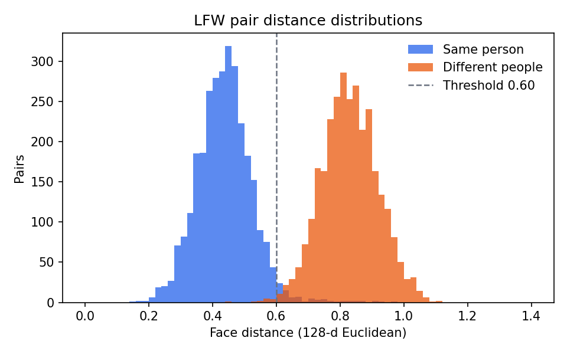
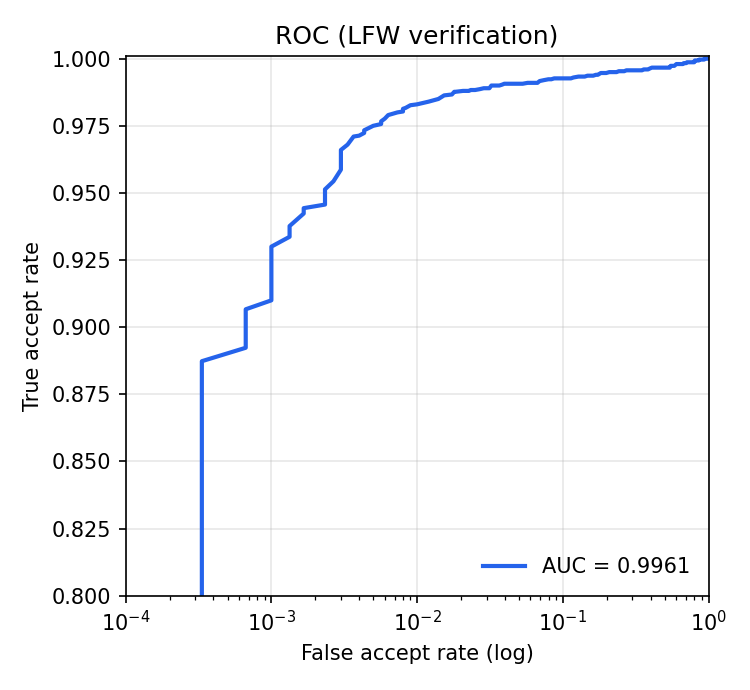
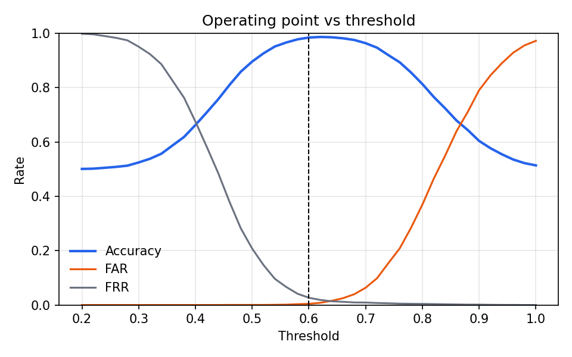
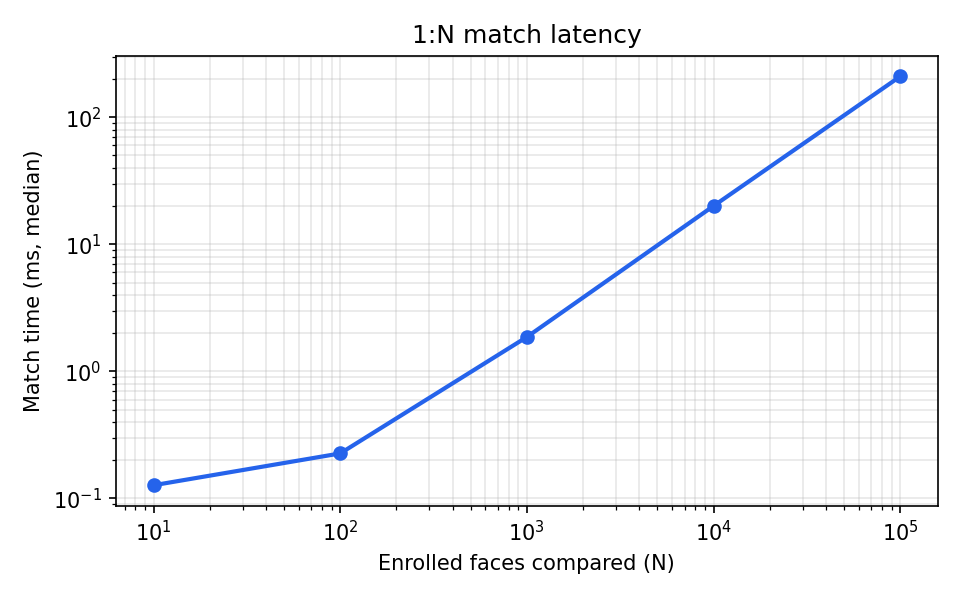
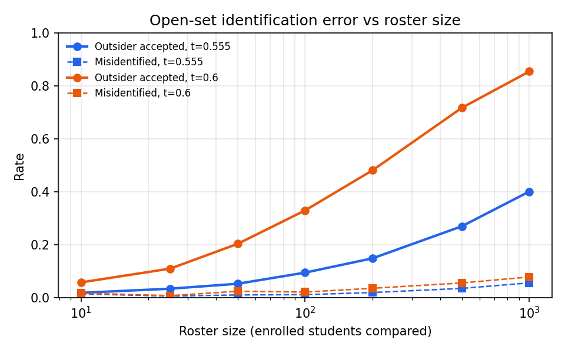

# Face recognition evaluation

Generated 2026-09-28T14:13:19.404761+00:00 on Windows-11-10.0.26200-SP0.

**Dataset:** LFW (Labeled Faces in the Wild), 10-fold pairs protocol  
**Engine:** dlib ResNet-34 (face_recognition_model_v1), 128-d, HOG detector, 5-point alignment

## Verification (1:1)

| Metric | Value |
|---|---|
| Pairs evaluated | 6000 (3000 genuine / 3000 impostor) |
| Face detection rate | 99.55% |
| Accuracy (k-fold) | 98.63% ± 0.37% |
| ROC AUC | 0.99611 |
| Equal error rate | 1.45% at distance 0.638 |
| At current threshold 0.6 | accuracy 98.45%, FAR 0.43%, FRR 2.67% |
| Median encode time | 1013.2 ms / image |

## Threshold recommendation

- Balanced (max accuracy): **0.625** — FAR 0.90%, FRR 1.73%
- Secure (FAR ≤ 0.1%): **0.555** — FAR 0.10%, FRR 7.60%
- Set FACE_MATCH_THRESHOLD in .env. Lower = fewer false accepts (impostors) but more students needing a manual override.

## Identification (1:N)

Gallery of 1559 identities, 3420 genuine probes, 2722 impostor probes.

| Metric | Value |
|---|---|
| Rank-1 accuracy | 90.67% |
| Correctly identified and accepted (DIR) | 90.61% |
| Rejected (needs manual override) | 0.23% |
| Misidentified and accepted | 9.15% |
| Impostors wrongly accepted (FPIR) | 91.44% |

### Error vs roster size

Averaged over random rosters. Every extra enrolled face is another chance of a false match, so outsider acceptance grows with the gallery. Matching is therefore scoped to the session's course roster, and the threshold should tighten for large rosters.

| Roster size | Threshold | Rank-1 | Correct + accepted | Misidentified | Outsider accepted |
|---|---|---|---|---|---|
| 10 | 0.555 | 96.44% | 93.11% | 1.39% | 1.77% |
| 10 | 0.6 | 96.44% | 95.50% | 1.67% | 5.71% |
| 25 | 0.555 | 98.71% | 91.94% | 0.50% | 3.33% |
| 25 | 0.6 | 98.71% | 97.24% | 0.70% | 10.92% |
| 50 | 0.555 | 96.54% | 90.89% | 0.98% | 5.20% |
| 50 | 0.6 | 96.54% | 95.51% | 2.38% | 20.28% |
| 100 | 0.555 | 97.25% | 92.35% | 1.08% | 9.41% |
| 100 | 0.6 | 97.25% | 96.50% | 2.05% | 32.93% |
| 200 | 0.555 | 95.86% | 91.46% | 1.89% | 14.82% |
| 200 | 0.6 | 95.86% | 95.37% | 3.49% | 48.10% |
| 500 | 0.555 | 94.08% | 90.76% | 3.44% | 26.93% |
| 500 | 0.6 | 94.08% | 93.85% | 5.50% | 71.70% |
| 1000 | 0.555 | 91.95% | 89.76% | 5.54% | 40.06% |
| 1000 | 0.6 | 91.95% | 91.84% | 7.77% | 85.45% |

## Scalability

| Enrolled faces compared | Match time (median) |
|---|---|
| 10 | 0.127 ms |
| 100 | 0.226 ms |
| 1,000 | 1.863 ms |
| 10,000 | 20.02 ms |
| 100,000 | 209.3 ms |

Matching is a single vectorised distance computation over the course roster; enrolment needs no retraining, so cost grows linearly with enrolled faces.

## Operational statistics (this deployment)

- Students with an enrolled face: 1 / 4
- Session check-ins: 0 (recognised 0, manual overrides 0, override rate 0.00%)
- Attendance by status: {'late': 1, 'present': 2}

## Charts

